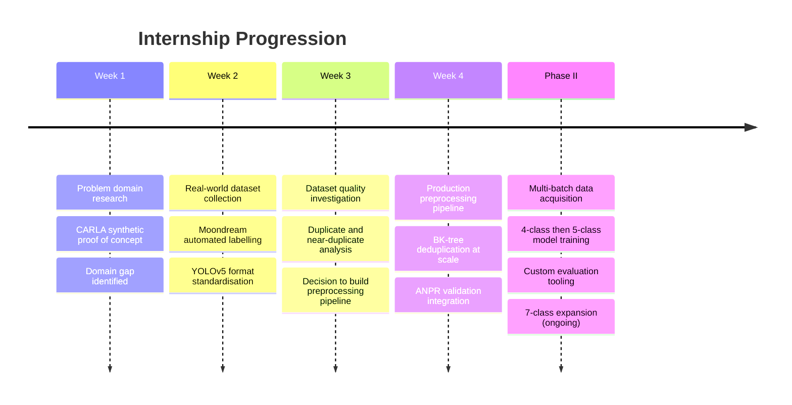
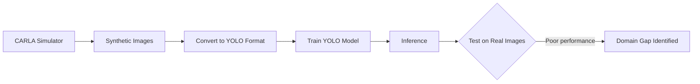
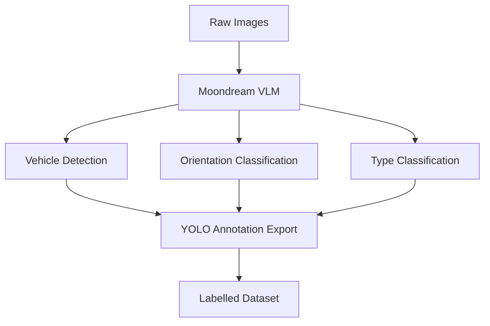
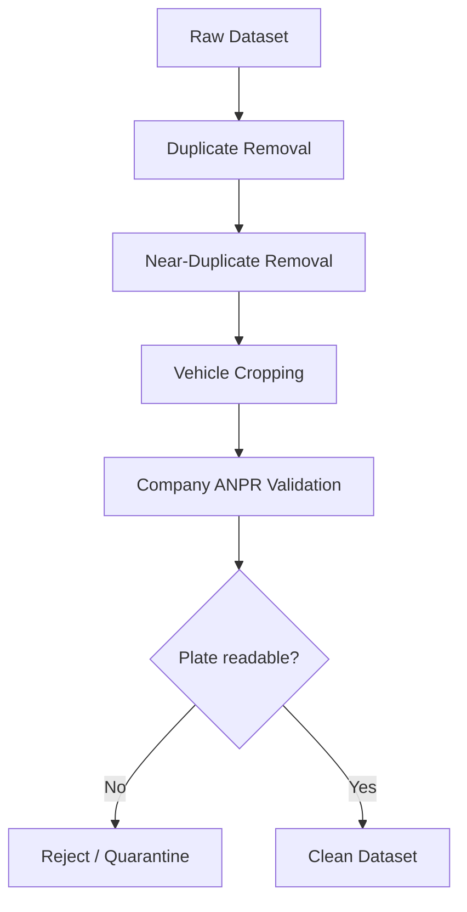
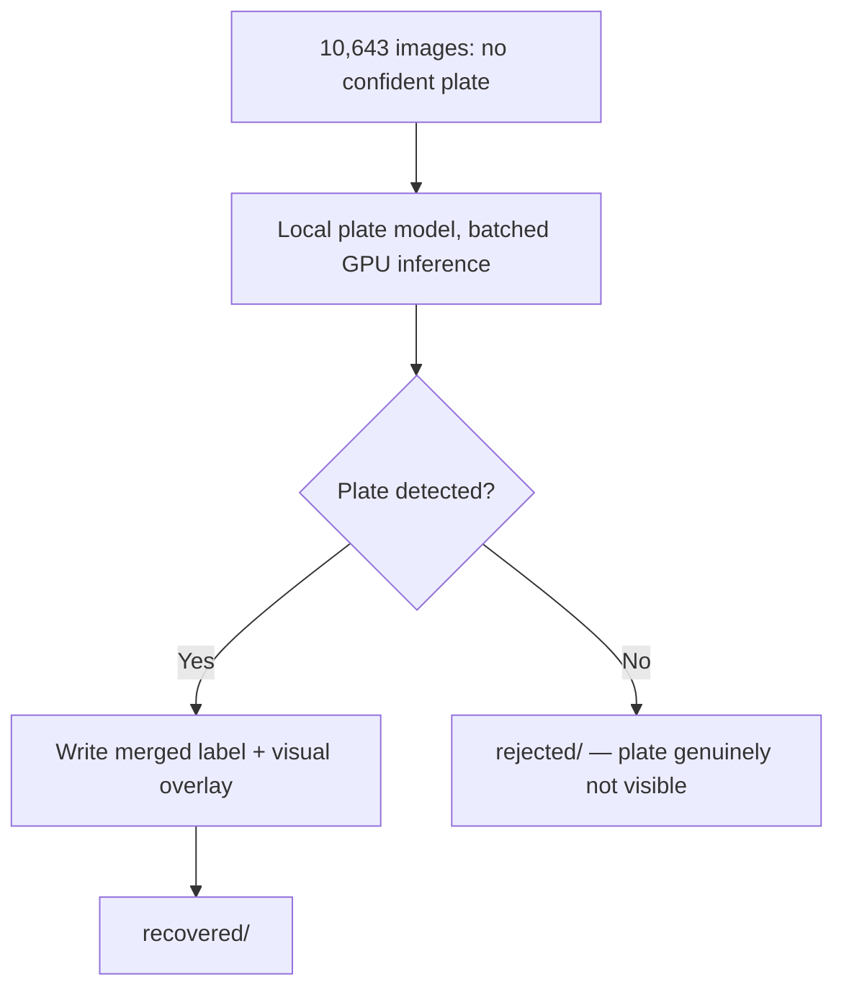
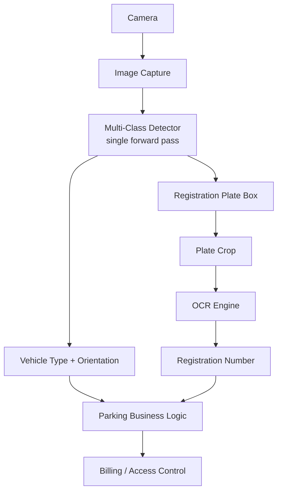
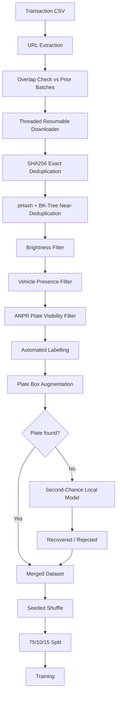

# Vehicle Orientation Classification and Dataset Engineering for an ANPR Pipeline

**AI/ML Internship — Engineering Report**

---

| | |
|---|---|
| **Project Title** | Vehicle Orientation Classification and Dataset Engineering for an ANPR Pipeline |
| **Role** | AI/ML Intern |
| **Author** | Neeraj Tiwari |
| **Duration** | ~30 days (Phase I), ongoing |
| **Infrastructure** | NVIDIA A100 80GB (MIG partition), Ubuntu Linux |
| **Framework** | PyTorch · YOLOv5 |
| **Status** | Phase I complete · Phase II in progress |

---

## Executive Summary

This report documents the design and construction of a production-grade computer vision pipeline for **Automatic Number Plate Recognition (ANPR)** in a parking-management context. The system determines, from a single camera image, what type of vehicle is present, which direction it is facing, and where its registration plate is located.

The internship did not begin with model training. It began by establishing that the problem was tractable, then discovering — through a failed first attempt — that the binding constraint was **data quality, not model architecture**. That finding redirected the remainder of the work.

**Phase I (Weeks 1–4)** established the problem domain, validated feasibility using synthetic data from the CARLA simulator, identified a severe synthetic-to-real domain gap, and responded by designing an automated labelling workflow and a production-scale preprocessing pipeline capable of handling approximately 400,000 images.

**Phase II (ongoing)** scaled that foundation into a trained detection system. The dataset grew from roughly 220,000 to 460,000 images across three acquisition batches. A registration-plate class was added to the label schema, converting four separate inference problems into a single multi-class detector. Custom evaluation tooling was built after standard detection metrics were found insufficient to answer the question that actually mattered.

### Headline results

| Metric | Result |
|---|---|
| Precision | **98.08%** |
| Recall | **97.27%** |
| mAP@0.5 | **98.99%** |
| mAP@0.5:0.95 | **93.78%** |
| Pure classification accuracy (4-class model) | **96.12%** |
| Dataset scale | ~460,000 images |
| Model footprint | 1.77M parameters · 4.2 GFLOPs |
| Plate labelling coverage | 286,456 of 297,099 images (96.4%) |

> **Principal engineering finding**
> Across the entire internship, every meaningful improvement in model performance came from improving the *data*, not from changing the *architecture*. The model was never the bottleneck.

---

## Table of Contents

1. [Company Background](#1-company-background)
2. [Problem Statement](#2-problem-statement)
3. [Internship Objectives](#3-internship-objectives)
4. [Timeline Overview](#4-timeline-overview)
5. [Phase I — Weekly Progress](#5-phase-i--weekly-progress)
6. [Phase II — Model Development and Scale-Up](#6-phase-ii--model-development-and-scale-up)
7. [System Architecture](#7-system-architecture)
8. [Technical Deep Dive](#8-technical-deep-dive)
9. [Engineering Decisions and Rationale](#9-engineering-decisions-and-rationale)
10. [Engineering Tooling Built](#10-engineering-tooling-built)
11. [Results and Evaluation](#11-results-and-evaluation)
12. [Challenges and Resolutions](#12-challenges-and-resolutions)
13. [Known Limitations](#13-known-limitations)
14. [Lessons Learned](#14-lessons-learned)
15. [Future Work](#15-future-work)
16. [Appendix](#16-appendix)

---

## 1. Company Background

The host organisation operates computer-vision infrastructure for automated parking and vehicle-management systems. Cameras positioned at entry and exit points capture vehicles as they pass, and an internal ANPR service extracts registration numbers from those images to drive billing, access control, and occupancy tracking.

The internship contributed to the perception layer that sits upstream of that ANPR service — specifically, the component that decides what is in an image before the plate is ever read.

---

## 2. Problem Statement

### The business problem

A parking system photographs every vehicle entering and exiting a facility. For billing and access decisions, four questions must be answered per image:

1. **Is there a vehicle present at all?**
2. **What class of vehicle is it?** — two-wheelers and four-wheelers are billed differently
3. **Which direction is it facing?** — front or back, which determines plate position and disambiguates entry from exit
4. **Where is the registration plate?** — the crop that gets passed to OCR

### The engineering problem

Answering these as four independent models means four forward passes per image, four sets of weights to maintain, and four opportunities for the components to disagree with one another. At the throughput a parking facility generates, that is both a latency cost and an operational burden.

The design target therefore became **a single detector that answers all four questions in one forward pass**, by encoding vehicle type and orientation jointly into the class label and treating the plate as simply another detectable object.

### Class schema evolution

| Version | Classes | Rationale |
|---|---|---|
| v1 (4-class) | `bike_front`, `bike_back`, `non_bike_front`, `non_bike_back` | Initial vehicle type × orientation |
| v2 (5-class) | v1 + `reg_plate` | Plate detection folded into the same model |
| v3 (7-class) | `bike_*`, `car_*`, `other_*`, `reg_plate` | Four-wheelers split into car vs. other for billing granularity |

> **Engineering Decision — Why encode orientation into the class instead of using a separate head?**
> YOLO's classification head already predicts a class per box. Expressing orientation as a class multiplication (2 vehicle types × 2 orientations) costs nothing additional at inference time and removes the need for a second model. The trade-off is a requirement for sufficient training examples in every combination — a condition the dataset scale was able to satisfy.

---

## 3. Internship Objectives

### Technical objectives

- Build a vehicle orientation classification model suitable for production deployment
- Design a dataset pipeline capable of operating at the scale of hundreds of thousands of images
- Integrate with the existing internal ANPR service
- Establish evaluation methodology that reflects real deployment requirements

### Learning objectives

- Understand end-to-end computer vision systems from camera to business logic
- Gain practical experience with object detection architectures and training
- Develop competence in GPU-based training workflows and Linux server operation
- Learn to reason about data quality as a first-class engineering concern

### Business objectives

- Reduce inference cost by consolidating multiple models into one
- Improve upstream data quality feeding the ANPR service
- Produce a repeatable pipeline so future data batches can be onboarded without bespoke work

---

## 4. Timeline Overview



### Phase summary

| Phase | Focus | Principal Outcome |
|---|---|---|
| Week 1 | Problem understanding + feasibility | Synthetic model works; domain gap discovered |
| Week 2 | Real-world data + auto-labelling | Automated annotation workflow established |
| Week 3 | Quality investigation | Data quality identified as binding constraint |
| Week 4 | Preprocessing at scale | Pipeline handling ~400k images |
| Phase II | Model development | 5-class detector at 93.78% mAP@0.5:0.95 |

---

## 5. Phase I — Weekly Progress

### Week 1 — Understanding the Problem

#### Objectives

Understand the business problem before writing any training code. Specifically: how ANPR systems function end to end, where orientation classification fits, and what the deployment environment demands.

#### Research

| Topic | Why it mattered |
|---|---|
| Computer Vision fundamentals | Baseline for everything downstream |
| CNNs | Architecture underlying all detection models used |
| Object Detection | Distinguishing classification from localisation |
| YOLO | Selected detection architecture |
| OCR | Downstream consumer of the plate crops |
| ANPR | The system this pipeline feeds |
| CUDA / NVIDIA GPUs | Training and inference hardware |
| PyTorch | Training framework |
| FastAPI / HTTP APIs | Interface to the internal ANPR service |
| Linux | Deployment and operational environment |
| vLLM | Serving infrastructure for the labelling model |
| Moondream | Vision-language model used for automated annotation |

#### Implementation — synthetic proof of concept

To test feasibility quickly without waiting on real-world data collection, a first model was trained on synthetic imagery generated from the **CARLA driving simulator**.



#### Results

The model learned front/back classification **successfully on synthetic images**. Tested on real-world photographs, performance degraded severely.

> **Challenge — Synthetic-to-real domain gap**
>
> **Observed:** A model with strong synthetic validation accuracy failed on real camera output.
>
> **Cause:** Systematic distribution differences between rendered and photographed imagery — lighting models, camera viewpoints and intrinsics, vehicle textures and materials, background complexity, weather, and sensor noise characteristics.
>
> **Resolution:** Rather than investing in narrowing the gap through domain adaptation or more elaborate rendering, the strategy shifted entirely toward building a high-quality real-world dataset.

#### Key learnings

- Synthetic data is valuable for *rapid feasibility testing* but carries no guarantee of transfer
- A model performing well on validation data drawn from the same distribution as its training data proves far less than it appears to
- The decision to abandon rather than repair the synthetic approach saved substantial time — recognising a dead end early is itself an engineering result

---

### Week 2 — Real-World Dataset Collection and Automated Labelling

#### Objectives

Acquire real-world vehicle imagery, establish a single canonical annotation format, and find a way to label at scale without manual annotation.

#### Implementation

Multiple publicly available datasets were surveyed and evaluated for suitability. **YOLOv5 annotation format** was selected as the common target, chosen because it is the format consumed directly by the training framework, avoiding a conversion step in the training loop.

Manual annotation was quickly ruled out. At the scale required, hand-labelling was not viable on any realistic timeline.

**Moondream**, a vision-language model served via vLLM, was evaluated as an automated annotator capable of:

- Detecting vehicles within an image
- Classifying front versus back orientation
- Distinguishing two-wheelers from four-wheelers
- Emitting YOLO-format annotations directly



#### Results and key learnings

- Annotation effort reduced by orders of magnitude relative to manual labelling
- Weak supervision — using models to label data for other models — is a practical necessity at scale, not a compromise
- Choosing the annotation format early, and standardising on it, prevented format-conversion complexity later
- Automated labels inherit the biases and failure modes of the labelling model, a constraint that shaped all subsequent evaluation work

---

### Week 3 — Dataset Quality Investigation

#### Objectives

Before committing GPU time to training, characterise the actual quality of the generated dataset.

#### Investigation findings

| Issue | Consequence if unaddressed |
|---|---|
| Duplicate images | Inflated apparent dataset size; leakage between train and test |
| Near-duplicate images | Same leakage risk, harder to detect |
| Multiple vehicles per image | Ambiguous supervision signal |
| Incorrect annotations | Model learns the annotator's errors |
| Images without readable plates | Training noise for a plate-detection objective |

> **Engineering Decision — Preprocess before retraining**
>
> The instinct after a disappointing model is to change the model. The investigation established that data defects, particularly duplication and annotation errors, would cap achievable performance regardless of architecture, model size, or hyperparameter tuning.
>
> Resource was therefore committed to a preprocessing pipeline rather than to architecture search.

#### Designed pipeline



#### Key learnings

- Data auditing is a prerequisite to training, not an optional refinement
- The duplicate problem is specifically dangerous because it produces *optimistic* metrics — the failure is silent

---

### Week 4 — Production Preprocessing Pipeline

#### Objectives

Implement a preprocessing system capable of operating on approximately 400,000 images on a Linux server with A100 GPU access.

#### Implementation

The pipeline was built as three modules with a strict separation of concerns:

| Module | Responsibility |
|---|---|
| `config.py` | Central configuration — paths, thresholds, API endpoints, thread counts |
| `utils.py` | Reusable primitives — hashing, BK-tree, ANPR client, thread-safe logging, safe file movement |
| `preprocess.py` | Orchestration — deduplication stage, validation stage, summary reporting |

#### Deduplication at scale

Two distinct mechanisms, addressing two distinct problems.

**Exact duplicates** — SHA256 hash of file bytes, resolved against a hash set in O(n).

**Near-duplicates** — perceptual hashing (pHash) combined with a **BK-tree** for Hamming-distance nearest-neighbour search.

> **Engineering Note — Why a BK-tree**
>
> Naive near-duplicate detection compares every image against every other image: **O(n²)**. At 400,000 images that is approximately 80 billion comparisons — computationally infeasible.
>
> A BK-tree exploits the fact that Hamming distance is a *metric* and therefore obeys the triangle inequality. Each tree edge is labelled with the distance between parent and child. When searching for all items within distance `d` of a query, the triangle inequality guarantees that a child at edge-distance `k` can only contain matches if `|k − dist(query, node)| ≤ d`. Every child failing that test is pruned along with its entire subtree.
>
> Lookup cost drops to approximately **O(log n)** in practice, making the problem tractable.

#### ANPR service integration

Validation was performed against the internal ANPR service over HTTP. Images were POSTed as multipart form data; the service returned detected plates with bounding boxes in image pixel coordinates, detection confidence, OCR text, and OCR confidence.

Images where no vehicle carried a readable plate were rejected — for the downstream OCR objective, such images contribute noise rather than signal.

#### Production engineering features

| Feature | Purpose |
|---|---|
| Multi-threading | Parallelise network-bound ANPR calls |
| Batch processing | Bounded memory footprint at scale |
| Thread-safe CSV logging | Every decision auditable after the fact |
| Checkpointing | Resume after interruption without reprocessing |
| Never-delete policy | Rejected files moved, never removed — every decision reversible |
| Collision-safe file movement | Prevent silent overwrites on name collision |
| Linux server deployment | Long jobs run under `screen`, surviving SSH disconnection |

> **Challenge — Interrupted long-running job**
>
> **Observed:** An accidental keyboard interrupt terminated a multi-hour preprocessing run at approximately 75% completion. All progress was lost.
>
> **Resolution:** Append-only checkpoint files were added to every long-running stage. On restart, completed items are loaded and skipped. Failures are deliberately *not* checkpointed, so a re-run automatically retries only what failed.
>
> **Wider lesson:** At this scale, resumability is not a convenience feature. It is a correctness requirement.

#### Results

A preprocessing pipeline capable of handling ~400,000 images, forming the foundation for all subsequent model training.

---

## 6. Phase II — Model Development and Scale-Up

Phase II converted the preprocessing foundation into trained models, and expanded the dataset substantially beyond its Phase I size.

### 6.1 Data acquisition at scale

Image URLs were extracted from parking-transaction CSV exports and downloaded in bulk. Three batches were acquired:

| Batch | URLs | Notes |
|---|---|---|
| Batch 1 | ~86,000 | Rear-facing camera angle |
| Batch 2 | ~202,000 | Rear-facing camera angle |
| Batch 3 | ~274,000 | Mixed day/night, mixed orientation |

Total dataset growth: approximately **220,000 → 460,000 images**.

> **Engineering Note — Cross-batch overlap verification**
> Before downloading each batch, URL sets were intersected in Python against all previously acquired batches. Zero overlap was confirmed prior to committing bandwidth. This prevented both wasted transfer and — more importantly — duplicate contamination that would have propagated into the train/test split.

The downloader was built threaded (32 workers), resumable, and atomic — writing to a `.part` file and renaming only on successful completion, so an interrupted download can never leave a truncated image that later reads as corrupt.

### 6.2 Multi-stage quality filtering

Batch 3 introduced a problem the earlier batches did not have: it contained night images so dark that orientation was genuinely undecidable — only headlights and the plate were visible.

**Stage 1 — Brightness filtering.** Mean brightness was scored per image using a 1/8-scale grayscale read (`cv2.IMREAD_REDUCED_GRAYSCALE_8`), chosen for speed and low memory footprint at scale. The distribution was banded, and **sample images from each band were visually reviewed** before selecting a cutoff.

| Brightness band | Image count |
|---|---|
| 000–010 | 97 |
| 010–020 | 2,024 |
| 020–030 | 10,860 |

A threshold of **40** was selected after visual inspection confirmed that images below it were not reliably classifiable by a human observer.

> **Engineering Note — Threshold selection methodology**
> The threshold was not chosen analytically. Sample images were extracted from each brightness band and inspected directly, and the cutoff was placed where human classification became unreliable. Where a threshold governs what data a model learns from, looking at the data is more defensible than picking a round number.

**Stage 2 — Vehicle presence.** Images with no vehicle detection above both a confidence threshold and a minimum-area threshold (2% of image area, excluding spurious background detections) were separated out.

**Stage 3 — Plate visibility.** Images where the ANPR service found no plate above threshold were separated. For a pipeline whose downstream consumer is OCR, an image with no visible plate carries no usable signal.

All three stages **moved** files into labelled folders rather than deleting them, with per-image decisions written to CSV.

### 6.3 Adding the registration plate class

The plate class was added by running the entire merged dataset through the ANPR service, converting returned pixel bounding boxes into normalised YOLO format, and appending them to existing label files.

| Outcome | Count | Share |
|---|---|---|
| Images with plate box added | 286,456 | 96.4% |
| No confident plate detected | 10,643 | 3.6% |
| Size read failures | 0 | 0% |
| ANPR service failures | 0 | 0% |

The implementation was made **idempotent** — existing plate-class lines are stripped before new ones are written — so re-running at a different confidence threshold never double-adds boxes.

### 6.4 Second-chance plate recovery

The 10,643 images without a confident plate were not discarded. A **separate local plate-detection model** was run over them as an independent second opinion, with class-id remapping from the plate model's own schema into the dataset's.



Recovered images were saved with an overlay drawing the detected box and its confidence, so the recovery could be manually verified rather than trusted blindly.

> **Engineering Decision — Why a second model rather than lowering the threshold**
> Lowering the ANPR confidence threshold would have recovered more plates *and* admitted more false positives across the entire dataset. Running a structurally different model over only the failures isolates the risk to the subset already known to be problematic, and provides genuine independent evidence rather than a weaker version of the same evidence.

### 6.5 Dataset splitting

The merged dataset was split 75% train / 10% validation / 15% test using a **seeded shuffle**.

> **Challenge — Merge-order splitting defect**
>
> **Observed:** The merged dataset was ordered by source — all of source A, then all of source B, then C.
>
> **Risk:** Splitting on that raw order would have assigned entire sources exclusively to individual splits. The test set would then have measured *"can the model generalise to a camera it has never seen"* rather than *"how good is this model"* — producing metrics that were misleading in a way no error message would reveal.
>
> **Resolution:** A seeded shuffle was applied before splitting. The fixed seed preserves reproducibility.
>
> **Wider lesson:** The most dangerous defects are the ones that produce plausible numbers rather than crashes.

Implementation detail: images are **symlinked** into split folders rather than copied, avoiding duplication of hundreds of thousands of files on disk. Labels are **copied**, since they are small and some pipeline stages mutate them per split.

### 6.6 Model training

**Model v1 — 4-class detector**

YOLOv5-nano, 320×320 input, batch 256, 100 epochs, initialised from COCO-pretrained weights.

| Class | GT boxes | Class accuracy |
|---|---|---|
| `bike_back` | 1,992 | 100.0% |
| `non_bike_back` | 3,336 | 93.8% |
| **Overall** | **5,157** | **96.12%** |

**Model v2 — 5-class detector (plate included)**

Fine-tuned from an existing single-class plate detector, expanding to five classes at higher resolution.

| Configuration | Value |
|---|---|
| Base weights | 1-class `reg_plate` detector (`nc=1`) |
| Target | 5 classes (`nc=5`) |
| Resolution | 320 → 640 |
| Initial learning rate | 0.01 → **0.001** |
| `iou_t` | 0.20 → **0.15** |
| Weight transfer | **343 / 349 tensors** |

Results at epoch 327 of 500:

| Metric | Value |
|---|---|
| Precision | 98.08% |
| Recall | 97.27% |
| mAP@0.5 | 98.99% |
| mAP@0.5:0.95 | 93.78% |

Training curve characteristics:

| Epoch range | mAP@0.5:0.95 | Interpretation |
|---|---|---|
| 0 → 40 | 0.486 → 0.894 | Rapid feature adaptation |
| 40 → 150 | 0.894 → 0.930 | Diminishing returns |
| 150 → 327 | 0.930 → 0.938 | Localisation refinement only |

By epoch 150, precision, recall, and mAP@0.5 had all plateaued. Only mAP@0.5:0.95 continued improving — indicating the model had found essentially all detectable objects and was refining box tightness, which matters disproportionately for small objects such as plates.

Validation losses tracked downward alongside training losses throughout, with no divergence — no overfitting signal across 327 epochs.

**Model v3 — 7-class expansion (in progress)**

The `non_bike` classes were split into `car` and `other` for billing granularity. Because the existing labels collapsed cars, trucks, and buses into a single class, this information had to be re-derived rather than remapped.

| Old class | New class | Method |
|---|---|---|
| 0 `bike_front` | 0 `bike_front` | Direct remap |
| 1 `bike_back` | 1 `bike_back` | Direct remap |
| 2 `non_bike_front` | 2 `car_front` or 4 `other_front` | Crop → COCO classification |
| 3 `non_bike_back` | 3 `car_back` or 5 `other_back` | Crop → COCO classification |
| 4 `reg_plate` | 6 `reg_plate` | Direct remap |

Only the two ambiguous classes required inference. Each existing box was cropped from its source image with padding for context and classified by a COCO-pretrained detector. **Box coordinates and orientation were never modified** — only the class digit changed.

Smoke-test distribution over 200 files:

| Decision | Count |
|---|---|
| Classified `car` | 111 |
| Classified `other` | 33 |
| Fallback (no detection) | 1 |

The `other` class represented approximately 23% of four-wheeler boxes — a workable balance rather than the severe imbalance that had been anticipated.

Phase II model v3 training is ongoing. Initial results were below expectation, and base-weight selection is currently under investigation.

---

## 7. System Architecture

### 7.1 Production inference pipeline



The consolidation is visible here: a single detector node produces both the vehicle classification and the plate localisation, where an earlier design would have required separate models for vehicle detection, type classification, orientation classification, and plate detection.

### 7.2 Data engineering pipeline



### 7.3 Repository structure

```
main/
├── config.py                    # Central configuration
├── utils.py                     # BK-tree, hashing, ANPR client, checkpoints
├── preprocess.py                # Deduplication + validation orchestration
│
├── download_images.py           # Threaded resumable downloader
├── make_yolo.py                 # Automated labelling
├── filter_brightness.py         # Brightness analysis and filtering
├── filter_dataset.py            # Vehicle + plate triage
├── add_plate_labels.py          # Plate class augmentation via ANPR
├── recover_plates_local.py      # Second-chance plate recovery
├── split_car_other.py           # 5-class → 7-class relabelling
├── merge_datasets.py            # Multi-source dataset merge
├── split_dataset3.py            # Seeded 75/10/15 split
├── add_dataset.py               # End-to-end batch orchestrator
│
├── eval_classification.py       # Classification accuracy + confusion matrix
├── eval_metrics.py              # Precision/recall/AP on arbitrary folder pairs
├── review_sample.py             # Sample review, good/bad triage
├── find_errors.py               # Worst-prediction analysis
├── find_plate_errors.py         # Plate-specific failure analysis
├── infer_draw.py                # Prediction visualisation
├── draw_labels.py               # Ground-truth visualisation
│
└── Dataset3_merged/
    ├── images/
    ├── labels/
    └── yolo_split/
        ├── train/{images,labels}
        ├── val/{images,labels}
        ├── test/{images,labels}
        └── data.yaml
```

---

## 8. Technical Deep Dive

### 8.1 Convolutional Neural Networks

A convolution slides a small learned kernel across an image; each output value is a weighted sum over a local neighbourhood.

Convolutions are used in place of fully connected layers for three reasons:

1. **Parameter sharing** — the same kernel applies at every position, so an edge detector is learned once rather than separately per pixel location
2. **Locality** — nearby pixels are correlated; distant ones generally are not
3. **Translation equivariance** — a vehicle shifted right produces the same features, shifted right

A fully connected layer operating on a 640×640×3 image would require approximately 1.2M weights *per neuron*, which is not tractable.

Networks build a **feature hierarchy**: early layers detect edges and colour transitions, middle layers detect textures and object parts, deep layers respond to object-level concepts. This hierarchy is precisely why transfer learning works — early-layer features are close to universal across vision tasks.

### 8.2 Object detection and YOLO

Classification answers *what is in this image*. Detection answers *what, where, and how many*.

| Approach | Mechanism | Trade-off |
|---|---|---|
| Two-stage (R-CNN family) | Propose regions, then classify each | Historically more accurate, slower |
| One-stage (YOLO, SSD) | Predict boxes and classes directly from feature maps | Faster; accuracy gap largely closed |

YOLOv5 comprises three components:

| Component | Function |
|---|---|
| **Backbone** (CSPDarknet) | Feature extraction with progressive downsampling |
| **Neck** (PANet/FPN) | Multi-scale feature fusion — high-resolution features for small objects, semantic features for large ones |
| **Head** | Outputs `(nc + 5) × anchors` channels per scale |

The `+5` comprises four box coordinates plus an objectness score.

**Anchor boxes** are pre-defined box priors at each grid cell. Rather than regressing coordinates from nothing, the network predicts offsets from these priors — a substantially easier learning problem. YOLOv5's **autoanchor** runs k-means over the dataset's box dimensions at training start and recomputes anchors to fit, which matters when target objects have unusual aspect ratios, as registration plates do.

**Non-Maximum Suppression (NMS)** resolves the multiple overlapping detections a detector produces per object: retain the highest-confidence box, suppress all boxes overlapping it above an IoU threshold, repeat.

### 8.3 Detection metrics

| Metric | Definition | Failure mode it reveals |
|---|---|---|
| **Precision** | TP / (TP + FP) | Low → too many false alarms |
| **Recall** | TP / (TP + FN) | Low → missing real objects |
| **IoU** | overlap / union | Localisation quality |
| **AP** | Area under precision-recall curve | Single-class summary |
| **mAP@0.5** | AP averaged over classes at IoU ≥ 0.5 | Lenient — detection presence |
| **mAP@0.5:0.95** | AP averaged over IoU 0.50…0.95 | Strict — rewards tight boxes |

> **Engineering Note — Computing AP correctly**
> AP is the area under the precision-recall curve, which requires predictions across the full confidence range to trace. Custom evaluation tooling therefore runs inference at a very low confidence threshold (0.001) to obtain the complete curve, and separately reports precision/recall/F1 at the intended deployment threshold. Thresholding before computing AP truncates the curve and understates the result.

### 8.4 Transfer learning and class-count changes

The detection head's output width is a function of the class count: `(nc + 5) × num_anchors` per scale. Changing the class count therefore changes the shape of the final convolution layers.

YOLOv5 handles this through `intersect_dicts()`:

```python
csd = ckpt["model"].float().state_dict()
csd = intersect_dicts(csd, model.state_dict(), exclude=exclude)
model.load_state_dict(csd, strict=False)
LOGGER.info(f"Transferred {len(csd)}/{len(model.state_dict())} items")
```

Only tensors whose shapes match are retained. Mismatched head layers are dropped and randomly reinitialised; backbone and neck transfer intact. In the 1→5 class transfer, **343 of 349 tensors carried over** — the six that did not were the detection head.

Loss gains are auto-scaled for class count and resolution:

```python
hyp["box"] *= 3 / nl                        # scale to detection layers
hyp["cls"] *= nc / 80 * 3 / nl              # scale to class count
hyp["obj"] *= (imgsz / 640) ** 2 * 3 / nl   # scale to image area
```

No manual adjustment is required when changing either.

### 8.5 Hyperparameter configuration

| Parameter | Value | Rationale |
|---|---|---|
| `lr0` | 0.001 | 10× below scratch default — prevents destroying pretrained features early |
| `lrf` | 0.01 | Final LR is 1% of initial — large steps to explore, small to settle |
| `momentum` | 0.937 | Velocity accumulation; smooths noisy gradients |
| `weight_decay` | 0.0005 | L2 regularisation |
| `warmup_epochs` | 3.0 | Early gradients are large and noisy; ramping prevents destabilisation |
| `iou_t` | 0.15 | Loosened from 0.20 — small objects struggle to exceed strict anchor-match thresholds |
| `mosaic` | 1.0 | Four-image stitching; strong small-object augmentation |
| `fliplr` | 0.5 | Horizontal flip — physically plausible |
| `flipud` | 0.0 | **Disabled** — vehicles are never inverted |
| `hsv_h/s/v` | 0.015 / 0.7 / 0.4 | Colour jitter for day/night and cross-camera robustness |

> **Engineering Note — Augmentation selection**
> Augmentations were chosen by physical plausibility rather than by default. Horizontal flip is valid: a vehicle facing left genuinely occurs. Vertical flip is not, and enabling it would teach the model to expect a configuration that never appears in deployment. HSV augmentation was kept aggressive because the dataset spans day and night across multiple camera installations.

### 8.6 Mixed precision training

Automatic Mixed Precision (AMP) uses FP16 for most operations and FP32 where numerical precision matters, with **loss scaling** to prevent small gradients underflowing to zero in FP16 representation. This yields roughly 2× throughput and halves memory consumption on modern GPUs.

### 8.7 GPU and infrastructure

Training ran on an **NVIDIA A100 80GB** partitioned via MIG (Multi-Instance GPU). The partition was shared with the ANPR inference service and other workloads, which had practical consequences:

- Apparent training stalls were frequently contention rather than failure
- Batch size selection had to account for co-tenancy rather than assuming exclusive access
- `nvidia-smi` and `top` became routine diagnostic tools rather than occasional ones

Long-running jobs were executed under **GNU `screen`**, surviving SSH disconnection — a necessity when a single training run spans many hours.

### 8.8 HTTP API integration

The internal ANPR service was consumed over HTTP with multipart file upload. Client-side engineering included:

| Concern | Implementation |
|---|---|
| Connection reuse | `requests.Session` with a sized `HTTPAdapter` connection pool |
| Retry | Bounded retries with linear backoff |
| Failure isolation | Network failures never raise into the pipeline; they return a status and are retried on the next run |
| Concurrency | Thread pool sized to the connection pool, since the workload is network-bound rather than CPU-bound |

---

## 9. Engineering Decisions and Rationale

### Why start with synthetic data?

Real-world data collection has a lead time. Synthetic data from CARLA could be generated immediately, which made it possible to answer *"is this problem learnable at all?"* within days rather than weeks. The answer was yes — and that finding justified the subsequent investment in real data collection.

### Why abandon the synthetic approach rather than improve it?

Closing a synthetic-to-real domain gap is an open research problem. Collecting real data is an engineering problem with a known solution. Given a fixed timeline, the engineering problem was the rational choice. The synthetic phase had already delivered its value: feasibility evidence.

### Why YOLO?

Single-stage detection produces boxes and classes in one forward pass, which directly serves the goal of consolidating four inference problems into one. YOLOv5 additionally offered mature tooling, a well-understood training pipeline, and a nano variant sized for edge deployment (1.77M parameters, 4.2 GFLOPs).

### Why preprocess before retraining?

The Week 3 investigation established that duplicates, annotation errors, and plate-less images would cap achievable performance regardless of architecture. Training a larger model on defective data produces a larger model that has learned the defects. Preprocessing addressed the actual constraint.

### Why remove duplicates specifically?

Duplicates cause **data leakage**. If the same image appears in both training and test splits, test metrics measure memorisation rather than generalisation — and they do so silently, producing numbers that look good. Deduplication had to precede splitting for this reason.

### Why validate with the ANPR service?

The downstream consumer of this pipeline is OCR. An image with no readable plate cannot serve that objective regardless of how well the vehicle is detected. Using the production ANPR service as the arbiter aligns the training data with the deployment requirement, rather than with a proxy for it.

### Why fine-tune rather than train from scratch?

Transfer learning reuses learned low- and mid-level features, which are largely task-agnostic. Random initialisation discards that and requires substantially more data and epochs to reach equivalent performance. With a nano model — low capacity, slower cold convergence — and a large but imperfectly labelled dataset, the warm start was clearly favourable.

### Why increase resolution from 320 to 640 for the plate model?

Registration plates are small objects, often occupying a small fraction of total image area. At 320×320 a plate can reduce to a handful of pixels after network downsampling, below reliable detection. Doubling input resolution approximately quadruples the pixel area available. The cost — roughly 4× compute and memory per image — was absorbed by halving batch size.

### Why lower the learning rate to 0.001?

At the scratch-training default of 0.01, early updates are large enough to destroy pretrained features before they can be usefully adapted, effectively reducing fine-tuning to scratch training with additional steps. A 10× reduction permits gradual adjustment. This is the single most consequential hyperparameter change when fine-tuning.

### Why build custom evaluation tooling?

Standard mAP conflates two distinct properties: box localisation quality and classification correctness. The operational question — *"given that a vehicle is present, does the model correctly identify its type and orientation?"* — is a classification question that mAP cannot isolate.

Custom tooling was built to match ground-truth boxes to predictions at a **deliberately loose IoU threshold of 0.3**, used purely to establish correspondence rather than to judge quality, then compare classes and construct a confusion matrix. This produced a pure classification accuracy figure independent of box tightness.

### Why validate against an external dataset?

The project's own test split shares label provenance with its training data — both were annotated by the same weak-supervision pipeline. A systematic annotation error is therefore rewarded rather than detected. An external plate dataset (40,419 images, independently labelled) provides genuinely independent evidence, and was evaluated using purpose-built tooling that handles non-standard folder layouts and remaps class ids in memory without modifying the source dataset.

---

## 10. Engineering Tooling Built

| Script | Purpose |
|---|---|
| `config.py` | Centralised configuration — single source of truth for paths and thresholds |
| `utils.py` | BK-tree, hashing, ANPR client, checkpointing, thread-safe logging |
| `preprocess.py` | Deduplication and validation orchestration with resumability |
| `download_images.py` | Threaded, resumable, atomic bulk downloader |
| `make_yolo.py` | Automated vehicle labelling with plate-visibility gating |
| `filter_brightness.py` | Brightness distribution analysis + banded sampling + filtering |
| `filter_dataset.py` | Vehicle presence and plate visibility triage |
| `add_plate_labels.py` | Idempotent plate-class augmentation via ANPR |
| `recover_plates_local.py` | Independent second-opinion plate recovery |
| `split_car_other.py` | Crop-based 5→7 class refinement |
| `merge_datasets.py` | Multi-source merge with symlinked images |
| `split_dataset3.py` | Seeded, reproducible 75/10/15 split |
| `add_dataset.py` | End-to-end orchestrator for future batches |
| `class_distribution.py` | Dataset class balance reporting |
| `eval_classification.py` | Classification accuracy + confusion matrix |
| `eval_metrics.py` | Precision/recall/F1/AP on arbitrary folder pairs |
| `review_sample.py` | Sample scoring with good/bad triage output |
| `find_errors.py` | Worst-prediction ranking with visual overlays |
| `find_plate_errors.py` | Plate-specific failure-mode breakdown |
| `infer_draw.py` | Prediction visualisation for manual review |
| `draw_labels.py` | Ground-truth visualisation for label verification |

> **Engineering Note — The `add_dataset.py` orchestrator**
> After the third data batch, the acquisition sequence had stabilised: extract URLs → download → label → merge → plate-label. This was consolidated into a single orchestrator so future batches require one command rather than a manual sequence. Recognising a repeated process and automating it is where pipeline work pays back.

---

## 11. Results and Evaluation

### 11.1 Model v1 — 4-class classification accuracy

| Class | GT boxes | Found | Correct | Class accuracy | Detection rate |
|---|---|---|---|---|---|
| `bike_back` | 1,992 | 1,917 | 1,917 | 100.0% | 96.2% |
| `non_bike_back` | 3,336 | 3,240 | 3,040 | 93.8% | 97.1% |
| **Overall** | **5,157** | — | **4,957** | **96.12%** | — |

### 11.2 Model v2 — 5-class detection metrics

| Metric | Value |
|---|---|
| Precision | 98.08% |
| Recall | 97.27% |
| mAP@0.5 | 98.99% |
| mAP@0.5:0.95 | 93.78% |
| Epochs completed | 327 / 500 |
| Overfitting observed | None — val loss tracked train loss throughout |

### 11.3 Dataset class distribution (4-class baseline)

| Class | Boxes | Share |
|---|---|---|
| `bike_front` | 61,571 | 26.8% |
| `bike_back` | 49,384 | 21.2% |
| `non_bike_front` | 68,516 | 29.7% |
| `non_bike_back` | 54,084 | 23.5% |
| **Total** | **233,555** | — |

Class balance across the four categories is close to uniform, which removes class imbalance as a confounding factor in the baseline results.

### 11.4 Plate labelling coverage

| Outcome | Count | Share |
|---|---|---|
| Plate box added | 286,456 | 96.4% |
| No confident plate | 10,643 | 3.6% |
| Failures | 0 | 0% |

---

## 12. Challenges and Resolutions

| Challenge | Root cause | Resolution |
|---|---|---|
| Synthetic model failed on real images | Domain gap in lighting, texture, viewpoint, noise | Strategic pivot to real-world dataset construction |
| O(n²) near-duplicate detection infeasible | 400k images → ~80B comparisons | BK-tree exploiting triangle inequality → ~O(log n) |
| Lost 75% of a multi-hour job to interrupt | No checkpointing | Append-only checkpoints on every long-running stage |
| Night images rejected en masse | Detection confidence threshold tuned for daylight | Lowered threshold after inspecting debug overlays |
| Undecidable dark images in batch 3 | Only headlights and plate visible | Brightness filter with visually-selected threshold |
| Framework incompatibility loading weights | Classic YOLOv5 `.pt` incompatible with newer `ultralytics` package | Load via `torch.hub.load(repo, 'custom', source='local')` |
| Apparent training stall | Shared MIG partition saturated by concurrent workloads | Diagnosed with `nvidia-smi`/`top`; scheduling adjusted |
| Test metrics would have been misleading | Merged dataset in source order | Seeded shuffle before splitting |
| Model trained on stale labels | YOLOv5 caches labels by directory path, not content | Delete `labels.cache` whenever labels change |
| numpy types not JSON-serialisable | `float32` from detector output in log writes | Custom JSON default handler for `np.generic`/`np.ndarray` |

> **Challenge — The label cache defect**
>
> **Observed:** After relabelling the dataset from 5 to 7 classes, training visualisations still showed the old class assignments.
>
> **Investigation:** Label files on disk were verified correct (classes 0–6 present). Cache files were found dated before the relabelling operation.
>
> **Cause:** YOLOv5 caches parsed labels in a `.cache` file keyed on directory path, not on content. Modifying labels in place while retaining the directory name causes the stale cache to be silently reused.
>
> **Resolution:** Delete `labels.cache` adjacent to any modified label directory. Verified by confirming the training visualisation file size changed — identical file sizes across runs had indicated identical rendered content.

---

## 13. Known Limitations

Stated explicitly, since understanding a system's weaknesses is part of understanding the system.

1. **Labels are model-generated, not human-verified.** Ground truth inherits the biases and failure modes of the labelling models. A portion of measured "errors" may be label noise rather than model error. Mitigated by sampling and visual inspection, but not eliminated.

2. **Validation labels share provenance with training labels.** The model can therefore be scored as correct for reproducing a systematic annotation error. Reported metrics are likely slightly optimistic. A human-annotated gold-standard holdout would resolve this.

3. **Orientation was assigned per batch, not predicted per image.** This is valid where a camera only ever observes one side, and breaks on mixed-orientation batches — a limitation encountered directly with batch 3 and not yet fully resolved.

4. **Car/other classification is two models deep.** The original four-wheeler detection came from one COCO pass; the car/other refinement from a second pass on a crop. Errors compound across the two stages.

5. **No production latency benchmark.** Model size is known (1.77M parameters, 4.2 GFLOPs) but end-to-end throughput on deployment hardware has not been measured.

6. **Class imbalance not explicitly handled.** `reg_plate` appears in nearly every image while vehicle classes divide across categories.

---

## 14. Lessons Learned

### Data quality dominates model complexity

Every meaningful performance improvement across this internship came from improving the data — deduplication, quality filtering, plate validation, correct splitting. No architecture change produced a comparable gain. The model was never the bottleneck.

### Synthetic data has a specific, bounded use

It answered *"is this learnable?"* quickly and cheaply. It did not answer *"will this work in production?"* Recognising which question a tool can answer prevents over-investment in it.

### The most dangerous defects produce plausible numbers

A crash is self-reporting. Duplicate leakage and merge-order splitting both produce *better-looking* metrics while silently invalidating them. This is the strongest argument for auditing data before trusting results.

### Standard metrics answer standard questions

mAP is the right metric for detection benchmarks. It was not the right metric for *"how reliably does this identify vehicle type and orientation?"* Building custom evaluation tooling to answer the actual operational question produced more actionable information than any amount of mAP tuning would have.

### Scale changes which approaches are viable

O(n²) is fine at a thousand images and impossible at four hundred thousand. Copying files is fine for a small dataset and wasteful for a large one. Checkpointing is optional for a one-minute job and mandatory for a six-hour one. Scale is not a multiplier on the same approach; it changes which approaches exist.

### Production ML is largely engineering

Threading, resumability, idempotency, atomic writes, audit logging, safe file handling, and cache invalidation consumed more effort than model architecture — and contributed more to the outcome.

---

## 15. Future Work

The internship is ongoing. The following are identified next steps.

### Immediate

- [ ] Complete 7-class model training and evaluate per-class performance
- [ ] Investigate base-weight selection for the 7-class configuration
- [ ] Resolve mixed-orientation labelling for batch 3
- [ ] Complete external-dataset validation on the full 40,419-image plate benchmark

### Near term

- [ ] Hand-label a 1,000–2,000 image gold-standard test set for unbiased metrics
- [ ] Per-class metric breakdown, particularly `reg_plate` recall relative to vehicle classes
- [ ] Benchmark inference latency on target deployment hardware
- [ ] Evaluate INT8 quantisation and TensorRT export

### Longer term

- [ ] Active learning — use model uncertainty to prioritise images for human annotation
- [ ] Dedicated orientation classifier for genuinely ambiguous images
- [ ] End-to-end integration testing against the production ANPR service
- [ ] Containerised inference service with a documented API contract

---

## 16. Appendix

### A. Technology stack

| Category | Technologies |
|---|---|
| Languages | Python 3.10 |
| Deep Learning | PyTorch, YOLOv5, Ultralytics |
| Computer Vision | OpenCV, Pillow, ImageHash |
| Vision-Language Models | Moondream (via vLLM) |
| Simulation | CARLA |
| Hardware / Acceleration | NVIDIA A100 80GB (MIG), CUDA |
| APIs | FastAPI, REST, Requests |
| Infrastructure | Ubuntu Linux, GNU screen, SSH |
| Monitoring | TensorBoard, nvidia-smi |
| Version Control | Git |
| Formats | YOLO annotation format, JSONL, CSV |

### B. Model configuration reference

| Parameter | Model v1 | Model v2 |
|---|---|---|
| Architecture | YOLOv5-nano | YOLOv5-nano |
| Classes | 4 | 5 |
| Input resolution | 320×320 | 640×640 |
| Batch size | 256 | 128 |
| Epochs | 100 | 500 (327 completed) |
| Optimiser | SGD + momentum | SGD + momentum |
| Initial LR | 0.01 | 0.001 |
| Base weights | COCO-pretrained | 1-class plate detector |
| Parameters | 1.77M | 1.77M |

### C. Glossary

| Term | Definition |
|---|---|
| **ANPR** | Automatic Number Plate Recognition |
| **mAP** | Mean Average Precision — averaged AP across classes |
| **IoU** | Intersection over Union — box overlap measure |
| **NMS** | Non-Maximum Suppression — duplicate detection removal |
| **BK-tree** | Burkhard-Keller tree — metric-space search structure |
| **pHash** | Perceptual hash — content-based image fingerprint |
| **AMP** | Automatic Mixed Precision — FP16/FP32 hybrid training |
| **MIG** | Multi-Instance GPU — NVIDIA GPU partitioning |
| **Weak supervision** | Using model-generated labels in place of human annotation |
| **Domain gap** | Distribution shift between training and deployment data |

---

*Report prepared as internal engineering documentation. Results reflect measurements taken during the internship period. Phase II work is ongoing.*
